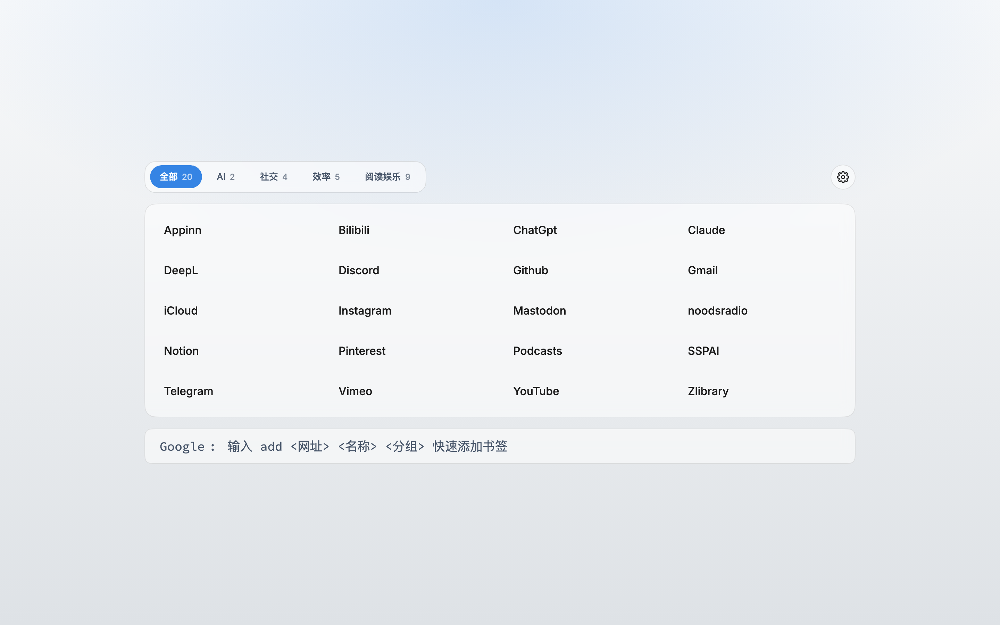
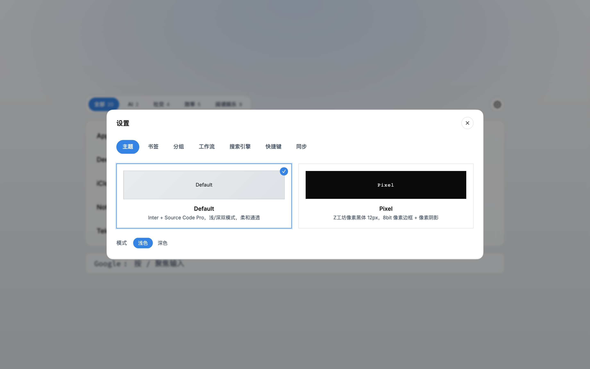
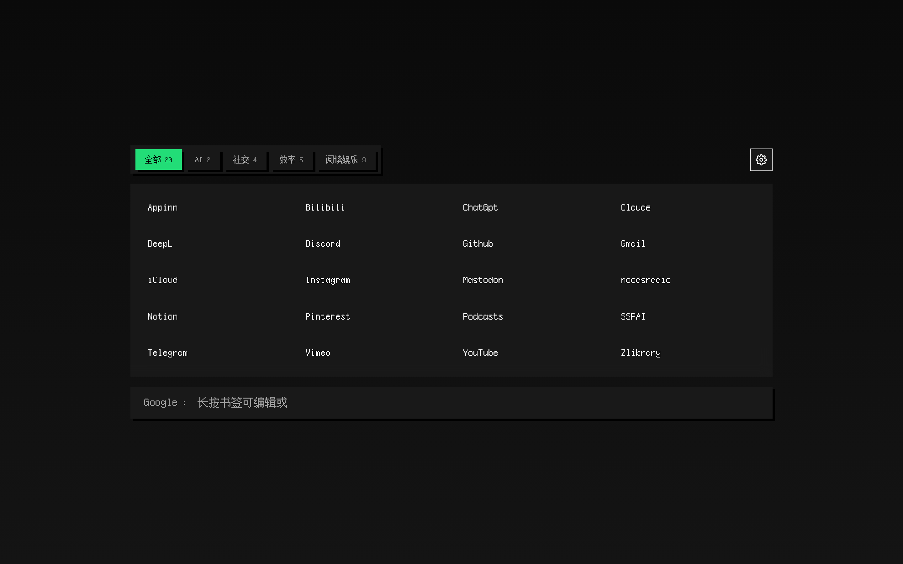
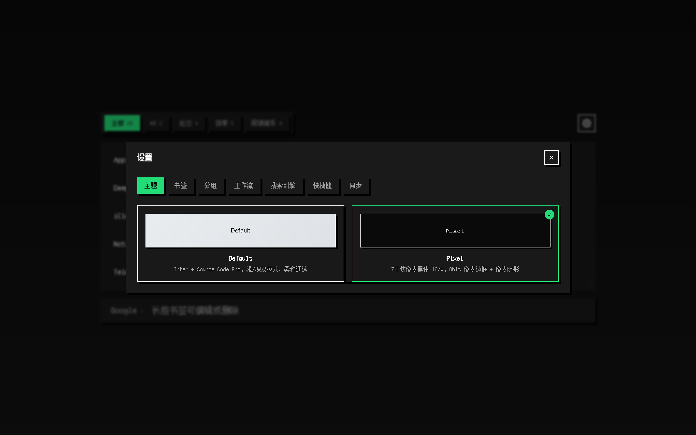

# zzhstart-page

> 一个功能完善的浏览器起始页，支持书签管理、自定义主题、终端风格搜索和 **跨设备同步**。

**在线预览**：[https://start-page-tau-flax.vercel.app/](https://start-page-tau-flax.vercel.app/)

<table>
  <tr>
    <td></td>
    <td></td>
  </tr>
  <tr>
    <td></td>
    <td></td>
  </tr>
</table>

## 功能

- **书签管理** — 增删改、批量导入、分组管理、排序、分页翻页
- **主题系统** — 默认主题（简洁现代）+ 像素主题（8-bit 风格），浅色/深色模式
- **终端搜索** — 多搜索引擎（Google/Bing/DuckDuckGo/Brave/自定义），`add` 命令快速添加书签
- **工作流** — 保存一组 URL，输入 `wf+名称` 批量打开
- **跨设备同步** — 基于 Supabase，登录后自动同步书签和设置。配置指南见 [SUPABASE.md](./SUPABASE.md)
- **设置面板** — 7 个子标签页：主题 / 书签 / 分组 / 工作流 / 搜索引擎 / 快捷键 / 同步

## 快捷键

| 快捷键 | 作用 |
|--------|------|
| `/` | 聚焦搜索框 |
| `Tab` / `Shift+Tab` | 切换分类 |
| `Esc` | 关闭面板 / 清空输入 |
| `↑` / `↓` | 浏览历史命令 |
| `Enter` | 打开书签 / 搜索 / 执行命令 |

终端栏命令：`关键词`（打开书签或搜索）、`r:查询`（强制搜索）、`add <url> <标题> <分组>`（快速添加）、`wf+名称`（打开工作流）

## 快速开始

```bash
git clone https://github.com/iszhjane/start-page.git
cd start-page
npm install
npm run dev        # http://localhost:4321
npm run build      # 构建到 dist/
```

**无 Supabase 也能用** — 不配置环境变量的话，页面所有功能正常，只是无法跨设备同步。

## 部署

支持任意静态托管平台。环境变量配置见 [SUPABASE.md](./SUPABASE.md)

| 平台 | 构建命令 | 输出目录 |
|------|----------|----------|
| Vercel | `npm run build` | `dist` |
| Netlify | `npm run build` | `dist` |
| Cloudflare Pages | Astro preset | `dist` |

## 技术栈

- **[Astro 6](https://astro.build/)** — 静态站点框架
- **[Tailwind CSS 4](https://tailwindcss.com/)** — 样式
- **[Supabase](https://supabase.com/)** — Auth + PostgreSQL + RLS
- **TypeScript** — 全栈类型安全
- **零后端** — 纯静态 + 客户端 Supabase

## 🙏 致谢

- [ahmetdem/start-page](https://github.com/ahmetdem/start-page) — 上游原项目
